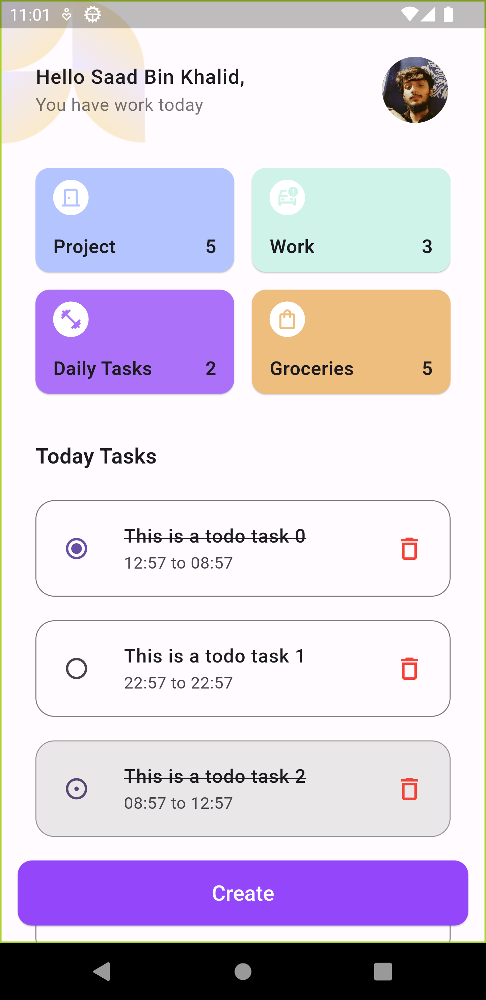
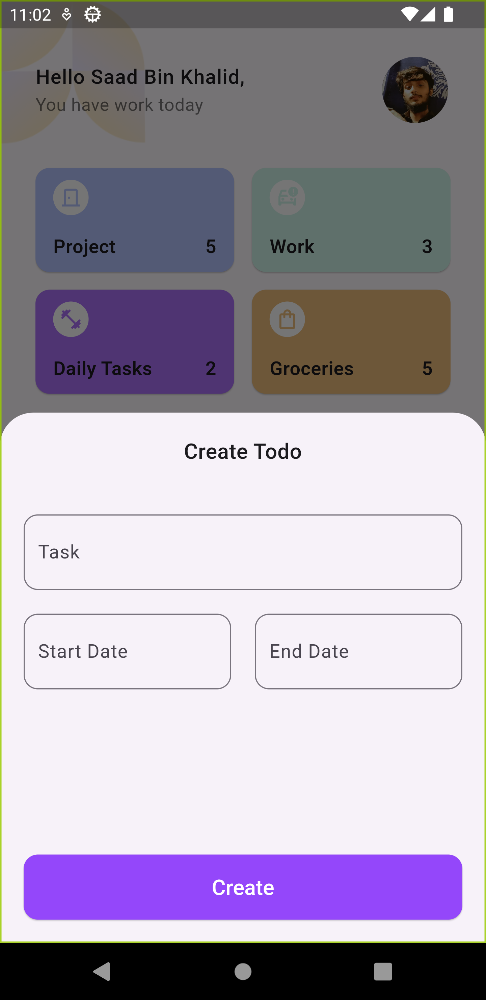

# Todo App

A beautiful todo app made with flutter.

## Screenshots

<div>



</div>

## Persistance

Permanent data persistance is achieved through the dart file APIs. Some core operations are listed below:

#### Streaming Todos

```dart 
Stream<List<Todo>> streamTodos() async* {
    yield readTodos();
    await for (final event in file.watch()) {
      if (event.type == FileSystemEvent.modify)
        yield readTodos();
    }
  }
```

#### Adding Todos

```dart 
void setTodos(List<Todo> todos) {
    final data = todos.map((t) => t.toMap()).toList();
    file.writeAsStringSync(json.encode(data));
}
```

#### Reading Todos

```dart 
List<Todo> readTodos() {
  final data = List.from(json.decode(file.readAsStringSync()));
  return data.map(Todo.fromMap).toList();
}
```

## Design Inspiration

https://www.figma.com/community/file/1334455555712570518/todo-app